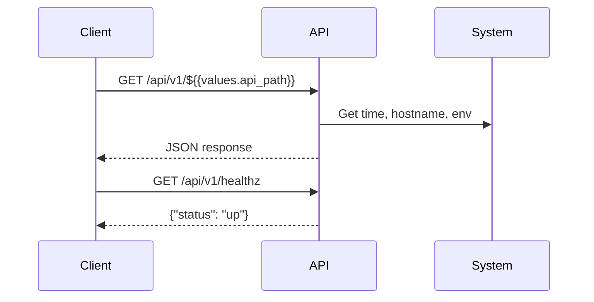

# Architecture

This application is a lightweight REST API built with Flask.

## Endpoints

- `/api/v1/${{values.api_path}}`: Returns a JSON object with a greeting, current server time, hostname, and an environment variable.
- `/api/v1/healthz`: Returns a simple health check status.

## Service endpoint

```bash
kubectlk get svc -n ${{values.component_name}}-${{values.environment}} -o jsonpath={.status.loadBalancer.ingress[0].hostname}
```

## Images

[Dockerhub/johnyunez](https://hub.docker.com/repository/docker/johnyunez/${{values.component_name}})

## Components

- **Flask**: Web framework for Python.
- **Docker** (optional): For containerized deployment.
- **Environment Variables**: Reads `INFRA_DATA` and sets `APP_ENV` for configuration.

## Sequence Diagram

